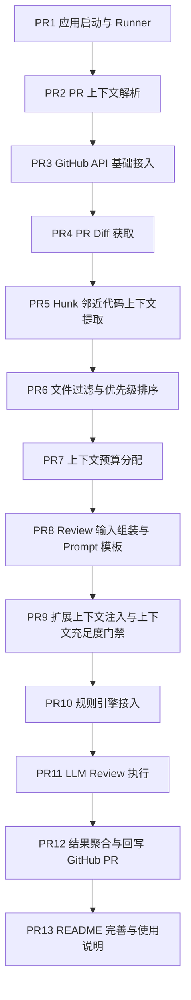

1. PR1：应用启动与 Runner
   含义：程序能在 GitHub Actions 里跑起来。

2. PR2：PR 上下文解析
   含义：拿到 owner/repo/pr number。

3. PR3：GitHub API 基础接入
   含义：认证、HTTP 调用、基础客户端。

4. PR4：PR Diff 获取
   含义：拿到 changed files、patch、增删行。

5. PR5：Hunk 邻近代码上下文提取
   含义：围绕 patch 提取 snippet，合并重叠窗口，处理 patch 缺失、删除文件、路径安全这些基础边界。

6. PR6：文件过滤与优先级排序
   含义：过滤图片、锁文件、构建产物、低价值文件，并确定哪些文件优先进入后续 AI 输入。

7. PR7：上下文预算分配
   含义：控制单文件、单批次、整个 PR 的上下文大小，决定哪些 patch/snippet/metadata 能进模型。

8. PR8：Review 输入组装与 Prompt 模板
   含义：把 patch + snippet + metadata 组装成统一输入对象，并定义 AI 提示词模板和输出 schema。

9. PR9：扩展上下文注入与上下文充足度门禁
   含义：补 PR title/body、少量 commit message、必要测试/接口信息，并判断当前上下文够不够审，不够就降级。

10. PR10：规则引擎接入
    含义：接 Semgrep / Checkstyle / SpotBugs 之类的确定性检查。

11. PR11：LLM Review 执行
    含义：真正调用模型，拿回结构化 findings。

12. PR12：结果聚合与回写 GitHub PR
    含义：合并规则结果和 AI 结果，去重、排序、发评论。

13. PR13：README 完善与使用说明
    含义：补项目介绍、工作流接入方式、配置项、运行说明、架构说明和效果展示。

每个pr开发流程
1，就是更新main分支，创建新分支并且命名，严格按照规范的pr流程执行
2，写代码，让codex跑测试，并做校验以及安全性，写注释，注释请按照当前项目风格，每个方法需有
3，提交推送，问codex需要几次推送，检查对接，
4，提交pr，描述，描述不应该有#号，作为规范型就行